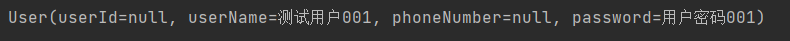
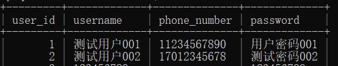
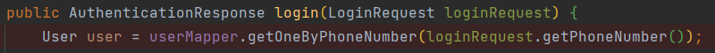
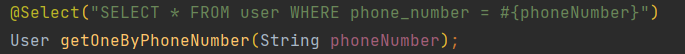

## ToDoList 项目后端开发
### 数据库设计

    用户实体
    属性：
    用户ID（主键）Long
    昵称 String
    手机号String
    密码String

    话题实体
    属性：
    话题ID（主键）Long
    用户ID（外键）Long
    话题名称 String
    话题完成 boolean

    任务实体
    属性：
    任务ID（主键）Long
    话题ID（外键）Long
    任务名称 String
    任务时间 String
    任务完成 boolean

### 已实现
    用户注册接口开发
    
    用户登录接口开发
### 待做
    
    系统前后端联合调试

    服务部署上线

### 正在做 Doing。。。
    
    （1）话题接口开发  start - 2022-12-31

    话题数据库表格创建完成了, 现在就是需要开发web接口相关的
    Controller-service-mapper这些接口,
    后续需要实现多表查询,通过用户ID,找到所有属于该用户的话题.
    
    接口开发阶段
     创建话题 - 需要联合前端调试来获取当前用户id。

    （2）平行开发 任务接口开发 start - 2023-1-1 

    创建数据库 - 创建实体 - 
      
    接口开发阶段
    创建任务 接口完成
    （3） 等待前端联合测试已经开发的功能
      

### 遇到的问题
1. 话题数据提交上来如何找到该用户的信息, 通过什么来将这个请求的用户和这个请求的数据绑定在一起

目前的解决方案, 应该是前端通过将登录成功获取的用户id或者Token一起来发送这个操作话题的接口请求
接口请求收到http请求之中,body带有请求参数,用于和数据库交互, 另外应该是请求的头部带有token或者用户ID,解析之后获取到对应的用户,
这样就获取到了这个话题属于哪一个用户了.

2. 前端请求的时候带上了用来唯一识别用户的ID， 这时候后端用什么来接收这个ID

3. 后端这边如何实时获取用户身份？

    解决方案：
>1. 请求头中的Authorization字段：浏览器在发出请求时，会在请求头中包含有关用户身份的信息（如用户名、密码等）。
>2. Cookie：服务器可以将用户身份信息存储在客户端的Cookie中，在服务器接收到请求时，可以从Cookie中获取到用户身份信息。
>3. 请求参数：客户端可以在发出请求时，在请求参数中包含用户身份信息，服务器可以从请求参数中获取用户身份信息。
>4. 路由参数：客户端可以在发出请求时，在路由参数中包含用户身份信息，服务器可以从路由参数中获取用户身份信息。

4. 跨域请求问题 （已解决）

       解决方案：
       1. https://blog.csdn.net/wangmx1993328/article/details/88524163
        这篇文章讲了7种解决方案，我选择了方式5：重写 WebMvcConfigurer接口(全局跨域) 
        重写了 addCorsMappings 方法设置跨域映射。

5. mybatis 查询结果对象数据不完整（待解决）
      
      
      
      
      

      
      用这个mapper查询的user对象id和phoneNumber都是null，但是数据库中数据是完整的。