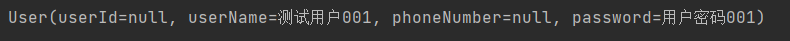
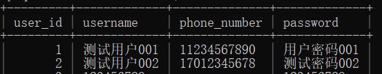
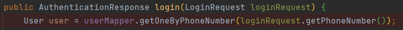
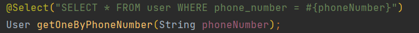
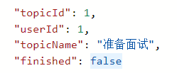
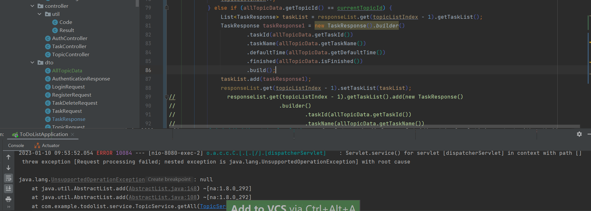
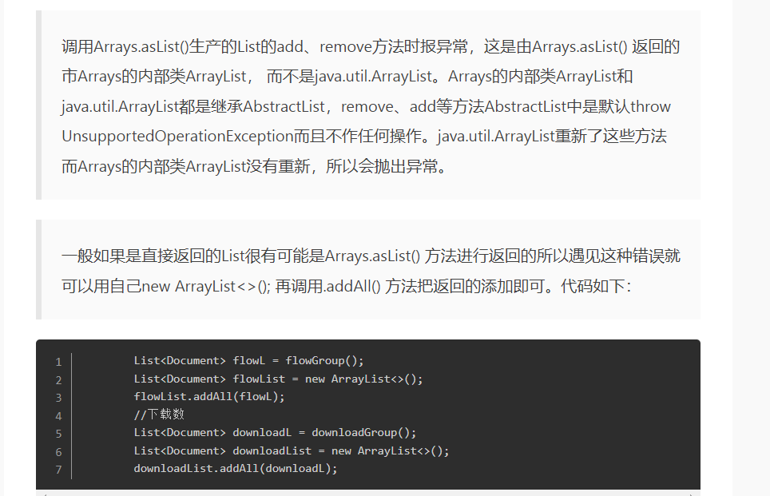

### 遇到的问题
1. 话题数据提交上来如何找到该用户的信息, 通过什么来将这个请求的用户和这个请求的数据绑定在一起

目前的解决方案, 应该是前端通过将登录成功获取的用户id或者Token一起来发送这个操作话题的接口请求
接口请求收到http请求之中,body带有请求参数,用于和数据库交互, 另外应该是请求的头部带有token或者用户ID,解析之后获取到对应的用户,
这样就获取到了这个话题属于哪一个用户了.

2. 前端请求的时候带上了用来唯一识别用户的ID， 这时候后端用什么来接收这个ID

3. 后端这边如何实时获取用户身份？

   解决方案：
>1. 请求头中的Authorization字段：浏览器在发出请求时，会在请求头中包含有关用户身份的信息（如用户名、密码等）。
>2. Cookie：服务器可以将用户身份信息存储在客户端的Cookie中，在服务器接收到请求时，可以从Cookie中获取到用户身份信息。
>3. 请求参数：客户端可以在发出请求时，在请求参数中包含用户身份信息，服务器可以从请求参数中获取用户身份信息。
>4. 路由参数：客户端可以在发出请求时，在路由参数中包含用户身份信息，服务器可以从路由参数中获取用户身份信息。

4. 跨域请求问题 （已解决）

       解决方案：
       1. https://blog.csdn.net/wangmx1993328/article/details/88524163
        这篇文章讲了7种解决方案，我选择了方式5：重写 WebMvcConfigurer接口(全局跨域) 
        重写了 addCorsMappings 方法设置跨域映射。

5. mybatis 查询结果对象数据不完整（已解决）
   

   

   

   
   用这个mapper查询的user对象id和phoneNumber都是null，但是数据库中数据是完整的。

   解决方案：
   因为没有实现实体和关系的映射，而且数据库表属性和对象属性不一样，导致mybatis查询结果为null；

6. 前端需要返回的数据为，除过前两个ID，如何将查询出来的数据进行处理，
   只给前端返回后两条数据的对象列表。（以解决）

   解决方案： 用Lombok的builder注解 实现对象映射。

7. web接口-根据用户Id查询所有话题，速度慢，待优化

   解决方案：利用sql联表查询，将数据一次性全部查出来，
   这样就不用再service层用一个循环去遍历查询sql，显著提升接口返回速度。
8.  出现一场，方法不支持

   解决方案： https://www.jianshu.com/p/d545901dd8d6

9. lombok 的@builder 来新建一个对象和用构造器来新建一个对象分别优缺点与选择（未解决）